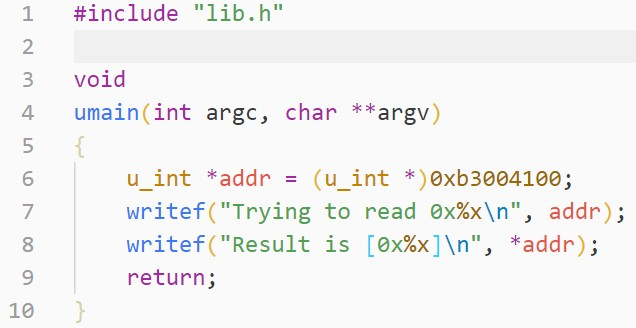
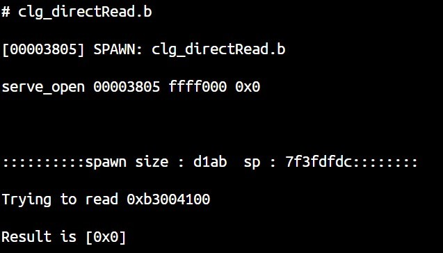
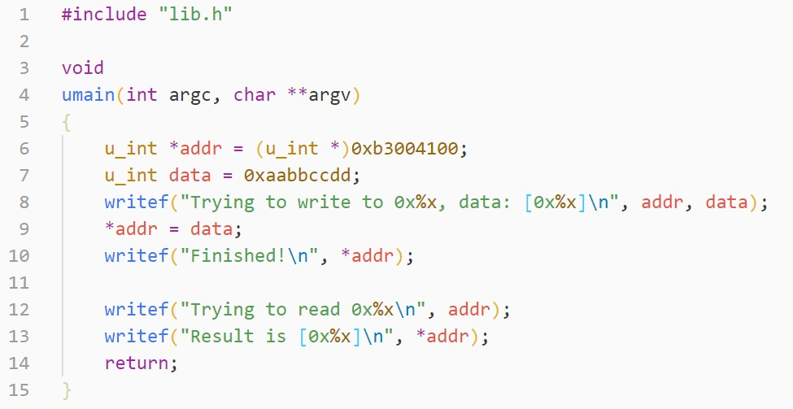
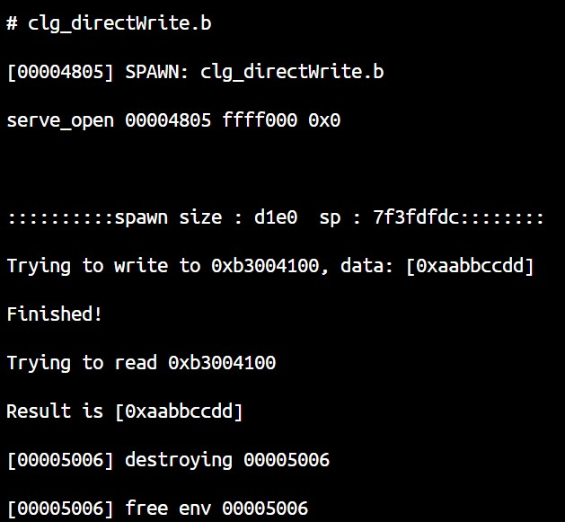
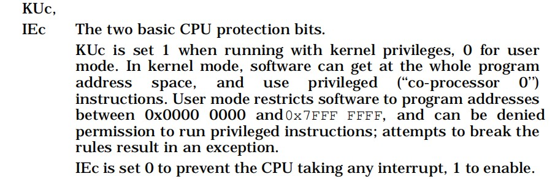
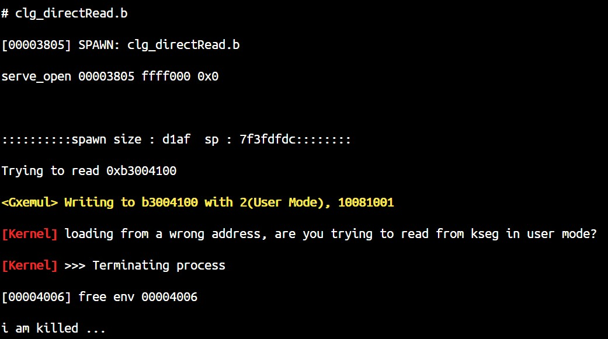
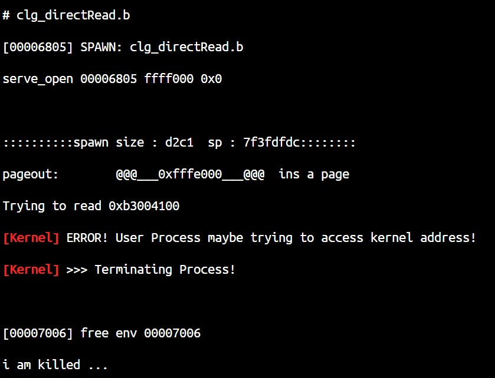
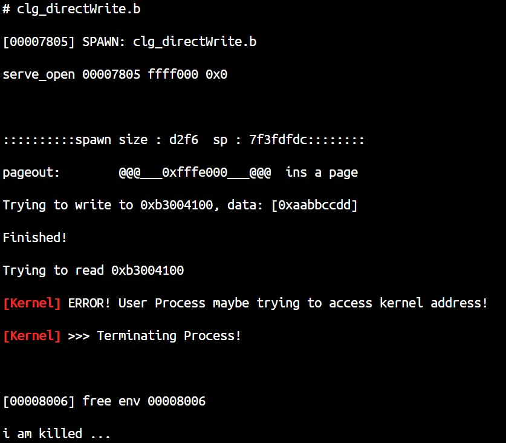
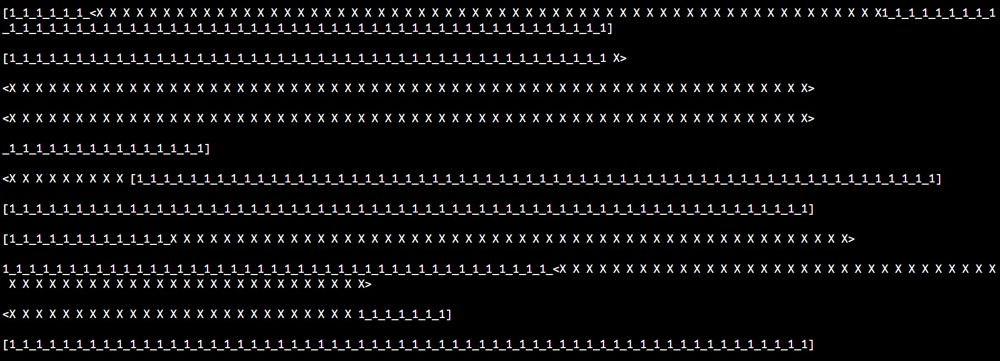
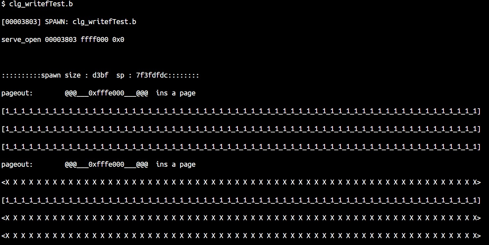

# Lab5-Challenge Report

## 一、实验过程

### 1. 设备访问保护-内存读写

```
1. 只有文件系统进程能读写IDE磁盘。
2. 文件系统进程仅能读写IDE磁盘而不能读写其他的内核地址。
```

读写设备的方法只有两种，一种是通过内存直接读写，另一种是通过系统调用。我们的进程运行在用户态，理论上来说访问内存中0x80000000以上的位置就会出现问题，但实际上访问可以正常进行。









经过测试我们发现，这是属于Gxemul的Bug，Gxemul对 MIPS R3000 CPU中 SR 寄存器 KUc位的理解和我们使用的MIPS标准不同。



而在Gxemul中

```c
/* src/include/mips_cpuregs.h
 *
 * The R2000/R3000-specific status register bit definitions.
 *  ......
 *	MIPS_SR_KU_CUR		Current kernel/user mode bit. 1 => user mode.
 */
```

既然这样，我们控制内存读写就有两个方案了，第一个方案是改动Gxemul，使其符合MIPS规范，第二个方案是改动我们的代码，让它适应Gxemul。

#### (1) 控制内存读写-更改Gxemul版

改动Gxemul，使其符合MIPS规范，主要修改的地方有：

- src\cpus\memory_mips_v2p.c
  
  修改其中关于用户态、内核态的检测

  ```c
  if ((status & MIPS1_SR_KU_CUR) == 0)
      ksu = KSU_USER;
  else
      ksu = KSU_KERNEL;
  ```

  目前的情况下，用户进程访问内核地址会产生TLE Refill，需要我们在handle_tlb里手动处理。既然已经修改了Gxemul，不妨再修改的彻底点，让他返回ADES/ADEL异常。

  ```c
  if (ksu == KSU_USER && vaddr >= 0xffffffff80000000ULL) {
      #include <stdio.h>
      //printf("visiting %x with %d, %x\n", vaddr, ksu, status);
      //fatal("visiting %x with %d, %x\n", vaddr, ksu, status);
      if(writeflag) {
          mips_cpu_exception(cpu, EXCEPTION_ADES, 0, vaddr,0, vaddr_vpn2, vaddr_asid, x_64);
          //printf("- [Gxemul] Writing to %x with %d(User Mode), %x\n\n", vaddr, ksu, status);
          printf("\033[1m\033[33m<Gxemul> Writing to %x with %d(User Mode), %x\033[0m\n\n", vaddr, ksu, status);
      }
      else {
          mips_cpu_exception(cpu, EXCEPTION_ADEL, 0, vaddr,0, vaddr_vpn2, vaddr_asid, x_64);
          //printf("- [Gxemul] Reading from %x with %d(User Mode), %x\n\n", vaddr, ksu, status);
          printf("\033[1m\033[33m<Gxemul> Writing to %x with %d(User Mode), %x\033[0m\n\n", vaddr, ksu, status);
      }
  }
  ```

- src\cpus\cpu_mips_coproc.c

  修改其中CP0 SR寄存器新建时的初始状态值

  ```c
  // in function mips_coproc_new
  c->reg[COP0_STATUS] = 2;
  ```

- src\cpus\cpu_mips.c

  修改其中CP0 SR寄存器在发生异常时的处理，使得异常发生时进入内核态

  ```c
  // in function mips_cpu_exception
  if (exc_model == EXC3K) {
	  /*  R{2,3}000:  Shift the lowest 6 bits to the left two steps:*/
	  reg[COP0_STATUS] = ((reg[COP0_STATUS] &~0x3f) | 0x2) + ((reg[COP0_STATUS] & 0xf) << 2);
  }
  ```

到这里，Gxemul要改动的部分就完了，但是经过运行，发现我们的OS代码里，也有类似的问题：KUc位经常会在内核态被设置为0，然后系统就会出现问题。因此，还需要更改部分代码：

- boot/start.S
- include/asm/cp0regdef.h (CU0 STATUS)
- include/stackframe.h
- lib/env_asm.S
- genex.S

此外，还要添加新的异常处理句柄，在此不再赘述。

效果如图（黄色为Gxemul的输出，红色为OS内核的输出）：




#### (2) 控制内存读写-更改操作系统代码版

既然是Gxemul和MIPS理解有出入，那么我们不妨按照Gxemul的想法来？

那么，操作系统内核KUc就应该是0（仔细一看代码发现原来就是这样），只需要更改新建进程的status为`0x1000100C`，一切就迎刃而解（刚才搞半天不是白搞了么）。

此外还需要增加对tlb_refill的判断，在此不再赘述。鉴于此方法修改少，Challenge的其他部分就基于该方法实现。

效果如图（黄色为Gxemul的输出，红色为OS内核的输出）：





### 2. 设备访问保护-系统调用

利用进程控制块的`env_nop`域存放设备权限信息，每一位对应一个设备，可以自由组合。

在读写设备时对照进行验证，如果无权限返回`-E_INVAL`。

添加`env_create_priority_devperm`函数在创建进程时设置权限，对于`syscall_env_alloc`创建的进程，默认与父进程对设备的读写权限相同。

新增`syscall_grant_devperm`系统调用，动态可以设置自身及子进程权限，要授予权限时，进程本身必须有此权限。

效果如下：

```
FS Program Writing RTC
[Kernel] Invalid write to devices!
result is -3, data should be 4660
FS Program Reading RTC
[Kernel] Invalid read to devices!
result is -3, data is 1
FS Program Writing fs
result is 0, data should be 305419896
FS Program Reading fs
result is 0, data is 305419896
```

```
# clg_sctest.b
[00003805] SPAWN: clg_sctest.b
serve_open 00003805 ffff000 0x0
::::::::::spawn size : d425  sp : 7f3fdfe0::::::::
pageout:        @@@___0xfffe000___@@@  ins a page
(Parent) Granting perm 0x7 to 0x4807, result is -3
(Parent) Granting perm 0x1 to 0x4807, result is 0
(Parent) Granting perm 0x5 to 0x4807, result is 0
NonFS Program Writing RTC
result is 0, data should be 4660
NonFS Program Reading RTC
result is 0, data is 0
NonFS Program Writing fs
[Kernel] Invalid write to devices!
result is -3, data should be 305419896
NonFS Program Reading fs
[Kernel] Invalid read to devices!
result is -3, data is 0
pageout:        @@@___0xfffe000___@@@  ins a page
Child running...
(Child) Granting perm 0x1 to 0x0, result is 0
NonFS Program Writing RTC
[Kernel] Invalid write to devices!
result is -3, data should be 4660
NonFS Program Reading RTC
[Kernel] Invalid read to devices!
result is -3, data is 4660
NonFS Program Writing fs
[Kernel] Invalid write to devices!
result is -3, data should be 305419896
NonFS Program Reading fs
[Kernel] Invalid read to devices!
result is -3, data is 0
```

### 3. writef优化

添加新系统调用`sys_print_string`，打印一个字符串，接收一个`char *`型变量作为参数。

writef时，先将内容输出到缓冲区，再调用系统调用原子性打印整个字符串。

为了保护系统安全，添加safeprint.h，此设置开启时，会将缓冲区固定映射到`0x0fffe000`的位置，系统调用时内核会在页面末尾添加`'\0'`，以防打印至其他区域。

使用改进的writef前：



使用改进的writef后：



### 4. 文件写回机制

Gxemul本身支持对img类磁盘镜像的写入，但是在我们的小操作系统里，由于脏位的设置出现问题，对文件的操作并不能真正写回磁盘。

fs\fs.c中，`file_dirty`函数置脏位的操作是

```c
*(volatile char *)blk = *(volatile char *)blk;
```

但是，我们文件系统页面映射时即有`PTE_R`权限，且我们并没有相应的机制标志页面为脏。

简单方法：直接用系统调用映射：
```c
syscall_mem_map(0, blk, 0, blk, ((*vpt)[VPN(blk)] & 0xfff) | PTE_D);
```

自找麻烦方法：建立部分页面脏标记机制，设置新PTE_X权限位（不应与PTE_R同时存在，这样写入就会产生pgfault），设置系统、用户的pgfault处理函数，在此权限位存在时，修改权限增加PTE_D和PTE_R。文件系统写回时，只写回脏页面。

对应的，修改部分程序`syscall_mem_map`中的权限，包括

- fs/fs.c
- fs/serv.c
- user/fd.c
- user/file.c
- user/fsipc.c
- user/spawn.c

此外，我们修改libos.c以便设置`pgfault_handler`，并且在进程退出时关闭所有fd。

修改写回机制前：

```
$ echo.b %%%%% > motd
$ cat.b motd

%%%%%
s /motd, the message of the day.

Welcome to the 6.828 kernel, now with a file system!

********** close and restart gxemul **********

$ cat.b motd

This is /motd, the message of the day.

Welcome to the 6.828 kernel, now with a file system!
```

修改写回机制后：

```
$ echo.b %%%%% > motd
$ cat.b motd

%%%%%
s /motd, the message of the day.

Welcome to the 6.828 kernel, now with a file system!

********** close and restart gxemul **********

$ cat.b motd

%%%%%
s /motd, the message of the day.

Welcome to the 6.828 kernel, now with a file system!
```

### 5. 终端退格支持

终端里如果打错字尝试退格时会出现问题，导致测试时非常麻烦。

原因是终端接收到的退格会被理解成`127:DEL`，因此只需修改user/console.c中的`cons_read`函数，增加如下内容。

```c
if (c == 127) {
    c = '\b';
    writef("\b ");
}
```

即可解决问题。

## 二、实验难点图示

Dirty位相关操作流程：


## 三、体会与感想

Challenge的自由度很高，同时我也认识到了我们的OS代码只是一个很基础的雏形，在很多方面需要仔细雕琢才有可能应用于实际。

## 附录：OS代码中可能存在的Bug

- mm/pmap.c中`tlb_invalidate`函数只能使curenv对应的TLB项无效。因此，在IPC中，如果进程A向某进程B发送页面，B的目标地址处原本存在页面并在TLB项中，由于IPC发送时curenv为A，所以B的原来页面的TLB表项不会被清除，进而引发问题。

测试程序：

```c
#include "lib.h"

/* This test could fail with correct vpt entry and wrong data, that's because tlb entry is wrong
 * tlb_invalidate() is not functioning as intended because of curenv is not target env, and the clear will fail
 * */

void umain()
{
    int parentId = syscall_getenvid();
    int childId = fork();

    u_int *va = 0x30000000;     // just pick one

    // both parent and child map page to va
    syscall_mem_alloc(0,va, PTE_R | PTE_V);

    if (childId == 0) {
        va[0] = 0xcccc;
        va[1] = 0x0000;
        va[2] = 0xeeee;
    } else {
        va[0] = 0x1111;
        va[1] = 0x2222;
        va[2] = 0x3333;
    }

    u_int pa = (*vpt)[VPN(va)];
    if (childId == 0) {
        writef("Child: [%x] [%x] [%x] [%x]\n", va[0], va[1], va[2], va[3]);
        writef("ChildVPT Entry: 0x%x\n", pa);
    } else {
        writef("Parent: [%x] [%x] [%x] [%x]\n", va[0], va[1], va[2], va[3]);
        writef("ParentVPT Entry: 0x%x\n", pa);
    }

    if (childId == 0) {
        writef("Child: IPC recving\n");
        int val = ipc_recv(0, va, 0);
        writef("Child: IPC recv fin, val = 0x%x\n", val);

        pa = (*vpt)[VPN(va)];
        writef("Child(IPC fin): [%x] [%x] [%x] [%x]\n", va[0], va[1], va[2], va[3]);
        writef("ChildVPT Entry(IPC fin): 0x%x\n", pa);

        // Child and Parent theoretically now have the same data in va
        user_assert(va[0] == 0x1111);
        user_assert(va[1] == 0x2222);
        user_assert(va[2] == 0x3333);

        writef("Child: fin\n");
    } else {
        writef("Parent: IPC sending 0x6666 and map [0x%x] to %d\n", va, childId);
        ipc_send(childId, 0x6666, va, PTE_R | PTE_V);
        writef("Parent: IPC send finished\n");
        writef("Parent: fin\n");
    }

    return;
}
```

- Gxemul的时钟中断需要进行响应，否则CP0的Cause寄存器会对应的中断位一直是1，如在lab5-extra中就可能会影响中断分发。

```none
rtc:
0x0110  Read or Write: Acknowledge one timer interrupt. (Note that if multiple interrupts are pending, only one is acknowledged.)
```

- fs/fs.c `dir_alloc_file`中，`dir->f_size += BY2BLK`发生在拿到block前，因此即使在获取block失败时仍会增大文件大小。

- fs/fs.c `file_truncate`中，`f->f_indirect = 0`发生在清空所有块之前，所以一个大于直接索引上限的文件，在truncate至小于直接索引上限之后，简介索引占据的块会无法释放。

- fs/fs.c `read_bitmap`中，bitmap所占硬盘块数目使用`nbitmap = super->s_nblocks / BIT2BLK + 1;`计算，在`s->nblocks`可整除`BIT2BLK`时会出现问题。

- fs/fsformat.c `init_disk`中，diff应为block数对每block的bit数取余后的位数对应的Byte数，应使用`diff = NBLOCK % BIT2BLK / 8;`而不是`diff = NBLOCK % BY2BLK / 8;`

- fs/fsformat.c `make_link_block`调用了`save_block_link`，当需要添加超过直接索引上限的块时，会直接执行如下代码。
  
  ```c
  if(f->f_indirect == 0) {
      // create new indirect block.
      f->f_indirect = next_block(BLOCK_INDEX);
  }
  ((uint32_t *)(disk[f->f_indirect].data))[nblk] = bno;
  ```

  此时，f->f_indirect的值和bno的值是一样的。这样，对任何这一块文件内容的写入就会直接破坏文件的间接索引。

- fs/ide_asm.S, lib/getc.S, drivers/gxconsole/console.c 中，对设备访问所使用的地址：都在Kseg0里，属于被Cache的区域。理论上来说不应该利用这一段内存来访问设备。事实上由于Gxemul几乎未实现缓存机制，所以暂时没受影响，但是这仍然是一种不合理的行为。
