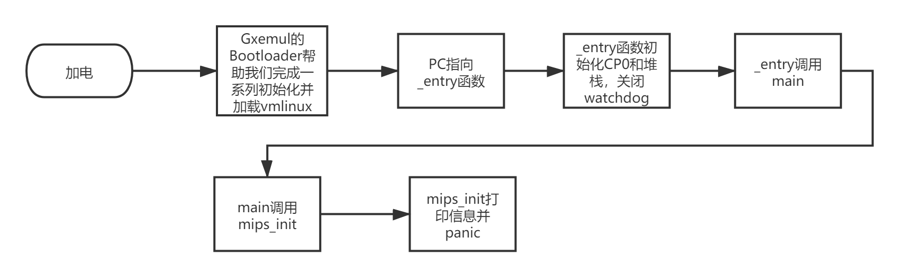
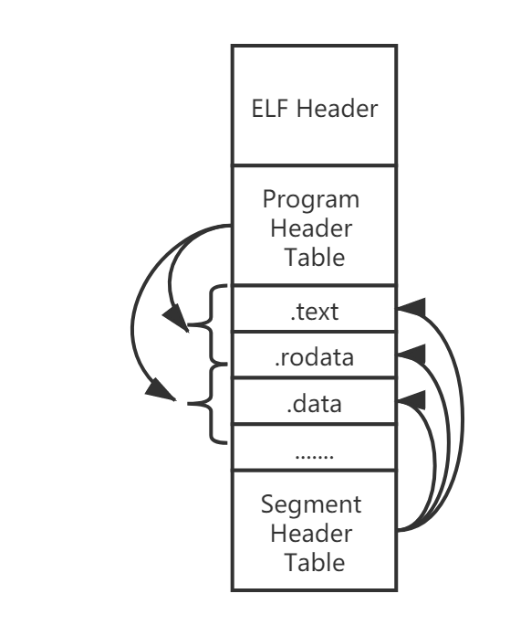

# Lab1 Report

### 一、实验思考题

##### Thinking 1.1

*也许你会发现我们的readelf程序是不能解析之前生成的内核文件(内核文件是可执行文件)的，而我们之后将要介绍的工具readelf则可以解析，这是为什么呢？(提示：尝试使用readelf -h，观察不同)*

因为我们自己写的readelf运行的机器和testELF文件都是在小端（little endian）环境下运行，而vmlinux是大端（big endian）格式存储，在大端环境下运行的。而linux默认的readelf有识别大小端并按相应方式处理的能力。

```
» readelf -h ./testELF
ELF Header:
  ......
  Data:                              2's complement, little endian

» readelf -h ../gxemul/vmlinux
ELF Header:
  ......
  Data:                              2's complement, big endian
```

***

##### Thinking 1.2 

*内核入口在什么地方？main 函数在什么地方？我们是怎么让内核进入到想要的 main 函数的呢？又是怎么进行跨文件调用函数的呢？*

- 由于编译脚本中`ENTRY(_start)`指令的作用，内核入口位于`start.S`中的`_start`函数（标号使用`LEAF`宏定义，该宏完成初始化堆栈等工作，以辅助函数调用）

- `main`函数在`init/main.c`中

- 我们通过一条jal指令调用`main`

- 跨文件调用时，跳转地址为一个标签，由链接器在连接过程中重定位至函数的真正地址

***

### 二、实验难点图示

##### 1. 实验用系统系统启动流程



##### 2. ELF文件结构



***

### 三、体会与感想

- 实验难度：中等偏下，主要困难在于要阅读大量源码，搞清楚工作原理。
- 实验耗时：8h-
- 感想：操作系统的启动是一个复杂的过程，在gxemul上进行的实验只是它经过很多简化过后的版本，真实生活中甚至会更麻烦，需要我们在以后的学习工作中仔细分析。
