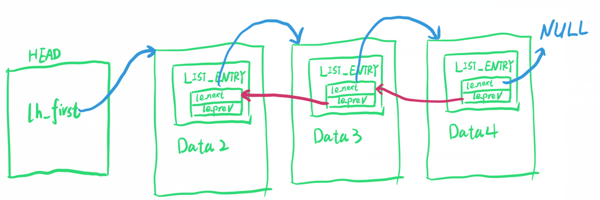
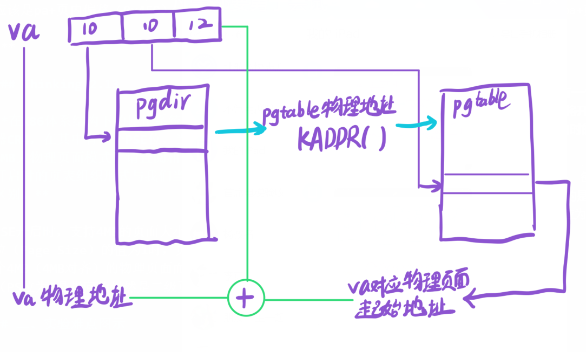

# OS Lab-2 Report

## 一、实验思考题

### Thinking 2.1

**请思考cache用虚拟地址来查询的可能性，并且给出这种方式对访存带来的好处和坏处。另外，你能否能根据前一个问题的解答来得出用物理地址来查询的优势?**

Cache可以用虚拟地址查询

虚拟地址查询对访存带来的好处：
- 如果数据在Cache中，可以节省访问TLB/页表的时间
- 由于使用了虚拟地址，可以更好地利用程序的空间局部性

虚拟地址查询对访存带来的坏处：
- 不同虚拟地址可能对应同一个物理地址，导致高速缓存重影这一严重的问题，甚至可能损坏硬件，需要额外检查。
- 不同进程的虚拟地址空间不同，要防止访问到错误的数据，还应引入校验位等其他机制，或者在进程切换时清空Cache，不利于进程间通信。

物理地址查询的优势：
- Cache设计更简单，重影问题很难发生
- 进程间切换时无开销，在共用同一个物理页面的程序之间（进程间通信）切换时效率更高。

***

### Thinking 2.2

**请查阅相关资料，针对我们提出的疑问，给出一个上述流程的优化版本，新的版本需要有更快的访存效率。（提示：考虑并行执行某些步骤）**

第3步中，没有命中时，重新装填和返回给CPU数据并行进行。

***

### Thinking 2.3

**在我们的实验中，有许多对虚拟地址或者物理地址操作的宏函数(详见include/mmu.h ),那么我们在调用这些宏的时候需要弄清楚需要操作的地址是物理地址还是虚拟地址，阅读下面的代码，指出x是一个物理地址还是虚拟地址**

x是一个虚拟地址，在C语言（包括汇编语言）中，能直接使用（存、取值）的地址都是虚拟地址。

***

### Thinking 2.4
**我们在 include/queue.h 中定义了一系列的宏函数来简化对链表的操作。实际上，我们在 include/queue.h 文件中定义的链表和 glibc 相关源码较为相似，这一链表设计也应用于 Linux 系统中 (sys/queue.h 文件)。请阅读这些宏函数的代码，说说它们的原理和巧妙之处。**

这一链表设计并不提供提供一个将其他结构体包起来的结构体，而是提供了一种可与其他结构体组合的小结构体。任何一个结构体，只要在自身加入这样一个链表结构体，就能应用链表的各种操作。

巧妙之处：
- 小结构体添加方便，基本不影响对原结构体的访问
- 小结构体中le_prev是一个指针的指针，因此在某个位置前后插入/删除节点时都不需要进行额外的遍历

***

### Thinking 2.5

**我们注意到我们把宏函数的函数体写成了 do { /\* ... \*/ } while(0)的形式，而不是仅仅写成形如 { /\* ... \*/ } 的语句块，这样的写法好处是什么？**

好处：
- 后面必须加分号，符合C语法习惯
- 在省略括号的if...else...结构中不会出错
  ```C
  #define FUNC(x) do{x = x + 1}while(0)
  if (var == 0)
    FUNC(x);
  else
    FUNC(y);
  // No Problem
  ```
  ```C
  #define FUNC(x) {x = x + 1}
  if (var == 0)
    FUNC(x);
  else
    FUNC(y);
  // Compile Error!
  ```

***

### Thinking 2.6

**注意，我们定义的 Page 结构体只是一个信息的载体，它只代表了相应物理内存页的信息，它本身并不是物理内存页。 那我们的物理内存页究竟在哪呢？Page 结构体又是通过怎样的方式找到它代表的物理内存页的地址呢？ 请你阅读 include/pmap.h 与 mm/pmap.c 中相关代码，给出你的想法。**

物理内存页就在物理内存里，并没有某个特别的结构占用一整个物理内存页。

系统启动时根据内存大小申请了一个Page结构体数组，通过Page的虚拟地址和Page结构体数组的头指针之间的差值，可以得到Page结构体对应的物理页框号。物理页框号乘以每页的大小就得到了物理页面的起始地址。

***

### Thinking 2.7
**请阅读 include/queue.h 以及 include/pmap.h, 将Page\_list的结构梳理清楚,选择正确的展开结构(请注意指针)。**

A:
```c
struct Page_list{
    struct {
         struct {
            struct Page *le_next;
            struct Page **le_prev;
        }* pp_link;
        u_short pp_ref;
    }* lh_first;
}
```

B:
```c
struct Page_list{
    struct {
         struct {
            struct Page *le_next;
            struct Page **le_prev;
        } pp_link;
        u_short pp_ref;
    } lh_first;
}
```

C:
```c
struct Page_list{
    struct {
         struct {
            struct Page *le_next;
            struct Page **le_prev;
        } pp_link;
        u_short pp_ref;
    }* lh_first;
}
```

正确的展开结构为C，Page\_list是由LIST_HEAD()宏产生的结构体，内部只包含一个指向链表节点的指针lh\_first。

***

### Thinking 2.8

**在 mmu.h 中定义了 bzero(void *b, size_t) 这样一个函数,请你思考，此处的b指针是一个物理地址， 还是一个虚拟地址呢？**

b是一个虚拟地址，在C语言（包括汇编语言）中，能直接使用（存、取值）的地址都是虚拟地址。

***

### Thinking 2.9
**了解了二级页表页目录自映射的原理之后，我们知道，Win2k内核的虚存管理也是采用了二级页表的形式，其页表所占的 4M 空间对应的虚存起始地址为 0xC0000000，那么，它的页目录的起始地址是多少呢？**

页目录地址为：0xC0000000 + (0xC0000000 >> 12) * 4 = 0xC0300000

***

### Thinking 2.10

**注意到页表在进程地址空间中连续存放，并线性映射到整个地址空间，思考：是否可以由虚拟地址直接得到对应页表项的虚拟地址？上一节末尾所述转换过程中，第一步查页目录有必要吗，为什么？**

可以由虚拟地址直接得到对应页表项的虚拟地址。但转换过程中，第一步查页目录仍有必要，因为我们并不知道页表项虚拟地址所对应的物理地址。

***

### Thinking 2.11

**观察给出的代码可以发现，page_insert 会默认为页面设置 PTE_V的权限。请问，你认为是否应该将 PTE_R 也作为默认权限？并说明理由。**

不应当，PTE_R会提供写权限，而我们的分配的页面可能是用来存放代码、常量等只读数据的。

***

### Thinking 2.12

**思考一下tlb_out 汇编函数，结合代码阐述一下跳转到NOFOUND的流程？从MIPS手册中查找tlbp和tlbwi指令，明确其用途，并解释为何第10行处指令后有4条nop指令。**

- tlbp：查询TLB内容。
- tlbwi：向TLB指定索引处写入值。
- 流程：先保存CP0_ENTRYHI，从CP0协处理器中查询TLB项，如果没有结果，证明查询的内容不在TLB中，跳转至NOFOUND，还原CP0_ENTRYHI；如果有结果，则向原表项处存入0，即使其无效，再跳转至NOFOUND，还原CP0_ENTRYHI
- 4条nop指令是为了清空流水线，防止CP0遇险

***

### Thinking 2.13

**显然，运行后结果与我们预期的不符，va值为0x88888，相应的pa中的值为0。这说明我们的代码中存在问题，请你仔细思考我们的访存模型，指出问题所在。**

page_insert函数只是将va所在的虚拟页号和一个物理页面对应起来，而va2pa函数返回的地址是va所在页的开头，因此va对应的物理地址并不是pa，而应该是pa+页内偏移（0x450）

***

### Thinking 2.13

**在X86体系结构下的操作系统，有一个特殊的寄存器CR4，在其中有一个PSE位，当该位设为1时将开启4MB大物理页面模式，请查阅相关资料，说明当PSE开启时的页表组织形式与我们当前的页表组织形式的区别。**

PSE开启时，支持4MB的页面大小。每条页目录项第7位（Page Size）的值为1时，页目录项指向的是一个4MB（4MB对齐）的物理页面而不是普通的页表（PS位为0是指向的仍然是二级页表）。

## 二、实验难点图示

1. List链表结构
   
2. pages数组结构
   
3. 虚拟地址-物理地址转换
   

## 三、体会与感想

本次实验难度为中高，总共花费20小时左右，主要难度在于对代码的阅读，链表结构的理解，特别是pages数组怎么转换到物理页面的这一点。