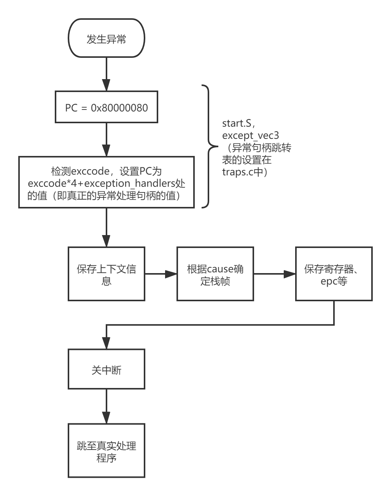
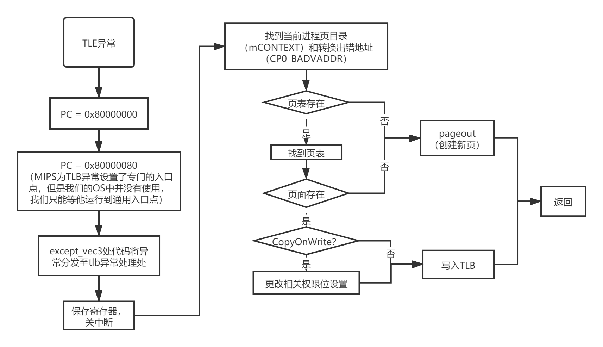

# OS Lab-3 Report

## 一、实验思考题

### Thinking 3.1

**为什么我们在构造空闲进程链表时必须使用特定的插入的顺序？(顺序或者逆序)**


按逆序插入，因为后期我们取用时使用`LIST_FIRST()`，第一个被取用的一定是`env[0]`，这样，我们第一个进程的envid值就是确定的，便于后期建立所有进程的进程树关系。

***

### Thinking 3.2

**思考env.c/mkenvid 函数和envid2env 函数:**

**• 请你谈谈对mkenvid 函数中生成id 的运算的理解，为什么这么做？**

**• 为什么envid2env 中需要判断e->env_id != envid 的情况？如果没有这步判断会发生什么情况？**

- 生成id：envid由两部分组成，低10位为env块在env数组中的编号；高22位为该进程是到目前为止运行的第几个进程。这样既能快速找到一个envid对应的env块，又能确定该进程不会与历史上已经结束的进程混淆。
- 需要确定找到的就是envid指向的进程，且该进程仍然存活，而不是某个正好占据相同位置的新进程。如果不做此步检查，当一个老进程结束后一个新进程正好占据老进程的位置，此时再用老进程的envid就会找到新进程的env块，引发问题。

***

### Thinking 3.3

**结合include/mmu.h 中的地址空间布局，思考env_setup_vm 函数：**

**• 我们在初始化新进程的地址空间时为什么不把整个地址空间的pgdir 都清零，而是复制内核的boot_pgdir作为一部分模板？(提示:mips 虚拟空间布局)**

**• UTOP 和ULIM 的含义分别是什么，在UTOP 到ULIM 的区域与其他用户区相比有什么最大的区别？**

**• 在env_setup_vm 函数的最后，我们为什么要让pgdir[PDX(UVPT)]=env_cr3?(提示: 结合系统自映射机制)**

**• 谈谈自己对进程中物理地址和虚拟地址的理解**

- 我们的操作系统采用的是2G/2G模式，内核态的地址空间对所有的进程都是一样的，以boot_pgdir作为一部份模板，可以使内核所在空间对用户进程可见，便于用户进程和内核的交互。
- UTOP是用户进程可以自由使用的地址空间的最高点，ULIM是kuseg和kseg0的分界。用户进程对在UTOP到ULIM之间区域的内存一般没有写权限
- 这样，用户进程可以直接使用UVPT这一虚拟地址访问页表，而UVPT是一个满足自映射条件的地址，在此处放置页表可以利用自映射性质省下一页的内存占用。
- 进程中，直接用来访问内存的地址都是虚拟地址。真实地址只有在TLB重填时才会被用到。可以说，对用户态进程来说，物理地址是透明的，用户进程无需关心数据的物理地址，只要有虚拟地址即可正常访问。

***

### Thinking 3.4 

**思考user_data 这个参数的作用。没有这个参数可不可以？为什么？（如果你能说明哪些应用场景中可能会应用这种设计就更好了。可以举一个实际的库中的例子）**

user_data这个参数允许我们更好的定制load_elf的行为，没有这个参数会影响系统的灵活性。我们在load时，可能会使用多种不同的mapper，这些mapper可能会需要不同的额外数据来辅助进行映射，void *类型的user_data是一个最好的传递额外数据的方式，因为向void *型指针强制转换可以自动完成，同时void *可读性也更好。在真实库中，如果某个函数需要使用到用户提供的函数，且希望具有类似泛型的，可处理多种数据的能力，就会用到这种设计。例如，C标准库中在stdlib.h里定义的qsort函数接受的cmp函数指针，就有两个void *型的参数。

***

### Thinking 3.5

**结合load_icode_mapper 的参数以及二进制镜像的大小，考虑该函数可能会面临哪几种复制的情况？你是否都考虑到了？ （提示：1、页面大小是多少；2、回顾lab1中的ELF文件解析，什么时候需要自动填充.bss段）**

- va
  - va与页面大小对齐
  - va与页面大小不对齐

- bin_size
  - bin_size <= 1页
  - bin_size > 1页

- va + bin_size
  - va + bin_size后还在va所在页内
  - va + bin_size后超出va所在页内
  - va + bin_size与页面大小对齐
  - va + bin_size与页面大小不对齐

- sgsize 
  - sgsize > bin_size：需要填充
  - sgsize = bin_size：不需要填充

***

### Thinking 3.6 

**思考上面这一段话，并根据自己在lab2 中的理解，回答：**

**• 我们这里出现的” 指令位置” 的概念，你认为该概念是针对虚拟空间，还是物理内存所定义的呢？**

**• 你觉得entry_point其值对于每个进程是否一样？该如何理解这种统一或不同？**

- “指令位置”针对的是虚拟空间，因为我们取指时用的地址是虚拟地址。
- 不一定一样。大部分ELF格式可执行文件的entry_point都是相同的，但是ELF格式文件中也允许设定程序的entry_point，这正体现了虚拟内存的优势：进程可以自主的决定自己的布局。此外，操作系统可以支持多种类型的可执行文件，这些可执行文件的entry_point也不一定相同。

***

### Thinking 3.7

**思考一下，要保存的进程上下文中的env_tf.pc的值应该设置为多少？为什么要这样设置**

应设为`env_tf.cp0_epc`。在我们的OS里，如果要进行进程切换，一定是因中断发生后的处理过程中，进入env_run时如果当前curenv不是null，则当前进程进入中断时的寄存器状态必定在TIMESTACK处存放（中断处理时会先调用`.\include\stackframe.h`中的saveall，而saveall依赖的sp指针值在时钟中断（目前唯一的中断）时正是TIMESTACK）。由于是通过中断进入的，EPC指向的值就是受害指令，如果我们以后要恢复这个进程的运行，当然是从受害指令开始重新执行，因此应设为`env_tf.cp0_epc`。

***

### Thinking 3.8

**思考TIMESTACK 的含义，并找出相关语句与证明来回答以下关于TIMESTACK 的问题：**

**• 请给出一个你认为合适的TIMESTACK 的定义**

**• 请为你的定义在实验中找出合适的代码段作为证据(请对代码段进行分析)**

**• 思考TIMESTACK 和第18 行的KERNEL_SP 的含义有何不同**

TIMESTACK就是时钟中断发生时系统存放相关数据（上下文、现场）时使用的栈空间，地址是0x82000000。证据如下：

从.\lib\traps.c中我们知道，所有异常的处理都是由异常处理句柄完成的，而一部分具体的异常处理句柄可以在.\lib\genex.S中找到。

异常处理句柄其实是由宏构建起来的，如下
```asm
.macro BUILD_HANDLER exception handler clear
.align 5
NESTED(handle_\exception, TF_SIZE, sp) 
.set noat
nop
SAVE_ALL 
__build_clear_\clear
.set at
move a0, sp
jal \handler
nop
j ret_from_exception
nop
END(handle_\exception)
.endm
```
这个宏表现出了异常处理句柄的一般形式：先保存上下文（SAVE_ALL），在跳转至特定的异常处理函数，最后从异常返回。其中，保存上下文（SAVE_ALL）这个过程定义在.\include\stackframe.h里

SAVE_ALL先调用get_sp来获得栈指针，并把寄存器等上下文信息存入栈中，get_sp内容如下：

```asm
.macro get_sp
mfc0 k1, CP0_CAUSE
andi k1, 0x107C
xori k1, 0x1000
bnez k1, 1f
nop
li sp, 0x82000000
j 2f
nop
1:
bltz sp, 2f
nop
lw sp, KERNEL_SP
nop
2: nop
.endm
```

get_sp所做的事情其实是：如果CP0_CAUSE中，exccode的值为0且IRQ4值为1，则使用0x82000000作为栈。否则，如果sp > 0x80000000，则直接使用sp，否则使用KERNEL_SP作为栈地址。而0x82000000就是我们的TIME_STACK，同时，IRQ4正是时钟中断的中断请求。

KERNEL_SP是内核处理各种异常中断时的通用的栈，而TIME_STACK专用于处理时钟中断和与之紧密联系的进程切换等任务。

***

### Thinking 3.9

**阅读 kclock_asm.S  文件并说出每行汇编代码的作用**

除了引用之外，kclock_asm.S可以分为两部分，第一部分是一个宏，负责对CP0的Status寄存器进行设置，将set中为1的位置为1，将clr中为1的位置为0

```asm
.macro setup_c0_status set clr
.set push
mfc0 t0, CP0_STATUS
or t0, \set|\clr
xor t0, \clr
mtc0 t0, CP0_STATUS
.set pop
.endm
```

第二部分是一个函数set_timer，负责开启时钟中断

```asm
.text
LEAF(set_timer)
li t0, 0x01
sb t0, 0xb5000100
sw sp, KERNEL_SP
setup_c0_status STATUS_CU0|0x1001 0
jr ra
nop
END(set_timer)
```
第1，2行
```
li t0, 0x01
sb t0, 0xb5000100
```
的作用是，让时钟以1s一次的频率产生中断。0xb5000100为时钟的控制地址

接下来`sw sp, KERNEL_SP`设置KERNEl_SP，内核异常处理栈的值

然后`setup_c0_status STATUS_CU0|0x1001 0`设置CP0的Status寄存器，STATUS_CU0为仅开启CU0，表示CP0存在的状态，0x1001，最低位1开启终端，第13位1使能IRQ4即时钟中断

最后`jr ra`返回主调函数

`LEAF(set_timer)`和`END(set_timer)`都是设置一些调试/链接用到的符号信息，在此不深入解释

***

### Thinking 3.10

**阅读相关代码，思考操作系统是怎么根据时钟周期切换进程的。**

时钟中断发生时，系统在保存上下文之后跳转到sched_yield函数，进行进程的调度。

sched_yield函数首先判断当前进程时间片是否用完，若未用完继续执行当前进程，否则根据调度算法选择一个新进程继续执行，原进程上下文被保存并再次进入就绪队列。

最终，新的进程通过调用env_run函数被执行。

***

## 二、实验难点图示

- 中断处理流程
  

- tlb重填流程
  

## 三、体会与感想

- 耗时：15h+
- 难度评价：难
- 本次Lab明显比前几次明显增大，部分原因在于进程管理本身就是个难点，而且还与Lab2结合，很可能一些早先没发现的bug就在这次Lab中出现问题了。这次的难度在于理解代码，再仅仅依靠注释无脑补全已经不现实了。需要把代码（包括且特别是汇编代码，genex.S）仔细阅读并理解。同时在处理调度算法和映射这部分内容时，一定要考虑好各种不同的情况。

## 四、【可选】指导书反馈

建议在指导书中加入更多汇编代码相关的介绍，这部分内容对我们对操作系统的理解一样很重要。比方说genex.S就非常重要。此外，希望可以改一下，注明bcopy和bzero必须在对齐地址上使用（或者直接改一下这两个函数？）。

## 五、【可选】残留难点

- 为什么env_destory的时候要把KERNEL_SP里的TRapframe拷贝到TIMESTACK里？在env_destory的时候已经把curenv设置为null了，理论上来说在之后运行sched_yield的时候，curenv是null，env_run也应该不需要保存TIMESTACK里的信息了
- 为什么专门要用env_sched_link连接调度env块？创建新进程插入的时候就应该已经把这个和freelist全部链接断开了，再用env_link应该也没问题吧。