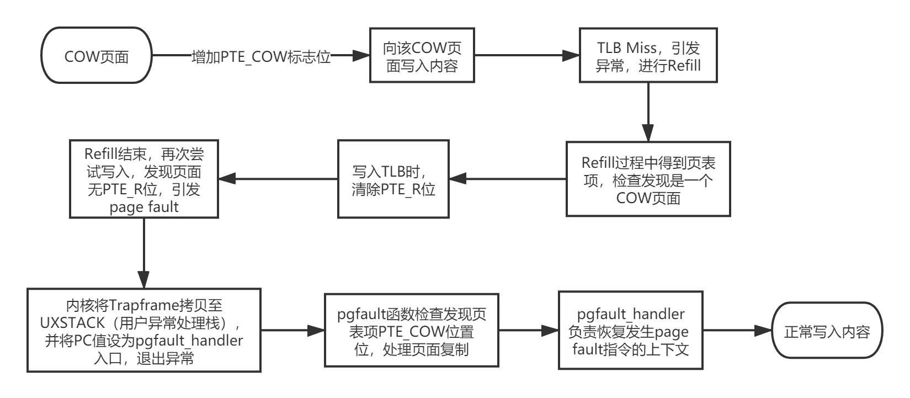

# OS Lab-4 Report

## 一、实验思考题

### Thinking 4.1 思考并回答下面的问题：

- *内核在保存现场的时候是如何避免破坏通用寄存器的？*
- *系统陷入内核调用后可以直接从当时的\$a0-\$a3 参数寄存器中得到用户调用msyscall 留下的信息吗？*
- *我们是怎么做到让sys 开头的函数“认为”我们提供了和用户调用msyscall 时同样的参数的？*
- *内核处理系统调用的过程对Trapframe 做了哪些更改？这种修改对应的用户态的变化是？*

1. 内核在保存现场时，首先利用\$k0, \$k1这两个不需要保护的寄存器，获取应该使用的\$sp值，然后首先将\$sp存入栈空间，再利用\$sp将所有寄存器的值入栈。这样在退出异常时可以进行恢复。
2. 可以（在本实验环境给定的代码中），因为本实验中从用户调用msyscall到跳转进入真正的handler的过程中没有用到\$a0-\$a3这些寄存器。但更推荐从栈中获取，这样可以防止其他程序使用这四个寄存器带来的问题。
3. 我们在syscall.S中将参数拷贝到内核的栈中和对应的寄存器中，将栈和寄存器“伪装成”正常调用sys开头的函数时的状态。
4. 设置epc的值为epc + 4，对应用户态pc + 4，返回时从syscall的后一条指令开始执行。系统调用的返回值放在v0中，用户态得到syscall_*的返回值

***

### Thinking 4.2 思考下面的问题，并对这两个问题谈谈你的理解：

- *子进程完全按照fork() 之后父进程的代码执行，说明了什么？*
- *但是子进程却没有执行fork() 之前父进程的代码，又说明了什么？*

1. fork()刚执行完时，父子进程的代码段以及大部分数据（除了fork的返回值外）内容完全相同。
2. 子进程是的pc值是fork时从父进程的pc复制来的。

***

### Thinking 4.3 关于fork 函数的两个返回值，下面说法正确的是：

```
A. fork 在父进程中被调用两次，产生两个返回值
B. fork 在两个进程中分别被调用一次，产生两个不同的返回值
C. fork 只在父进程中被调用了一次，在两个进程中各产生一个返回值
D. fork 只在子进程中被调用了一次，在两个进程中各产生一个返回值
```

正确答案是C，fork前子进程并不存在，子进程在父进程调用fork时被创建，并赋予不同的返回值。

***

### Thinking 4.4 

*如果仔细阅读上述这一段话, 你应该可以发现, 我们并不是对所有的用户空间页都使用duppage 进行了保护。那么究竟哪些用户空间页可以保护，哪些不可以呢，请结合include/mmu.h 里的内存布局图谈谈你的看法。*

不可写(PTE_R未设置)或父子进程共享(设置PTE_LIBRARY)的页，我们不应用PTE_COW予以保护。除此以外USTACKTOP以下可写的段都可以保护，USTACKTOP到UTOP之间的位置不能被保护。在\[USTACKTOP， UXSTACKTOP - BY2PG\)位置存放的是无效内存，而\[UXSTACKTOP - BY2PG, UXSTACKTOP)位置是用户的缺页异常处理栈，父子进程不能共用，而且处理page fault需要借助以上两片空间，因此我们不能用PTE_COW保护。User VPT对应的从UVPT开始的4M空间是进程的页表我们显然不能从父进程复制，因此也就没有保护的必要。UPAGES和UENVS对应的4M空间都是所有进程共享因此不需要保护。再向上是内核空间我们同样不应用PTE_COW权限位。

***

### Thinking 4.5

*在遍历地址空间存取页表项时你需要使用到vpd 和vpt 这两个“指针的指针”，请思考并回答这几个问题：*

- *vpt 和vpd 的作用是什么？怎样使用它们？*
- *从实现的角度谈一下为什么能够通过这种方式来存取进程自身页表？*
- *它们是如何体现自映射设计的？*
- *进程能够通过这种存取的方式来修改自己的页表项吗？*

1. vpt是指向虚拟页表的指针**的指针**，vpd是指向虚拟页目录的指针**的指针**，\*vpt = 7fc00000 = UVPT，而 \*vpd = 7fdff000 = (UVPT+(UVPT>>12)*4)。我们通过((Pte \*) (\*vpt))\[pgtblIndex\]来获取pgtblIndex对应的页表项，通过((Pde \*) (\*vpd))\[pgdirIndex\]来获取pgdirIndex对应的页表项。
2. vpt和vpd在entry.S汇编中定义，指向UVPT和UVPT中页目录对应的虚拟地址。而具体能访问到页表是因为我们在env_setup_vm中，将UVPT ~ ULIM所在的4M空间对应的一张二级页表的物理地址设为页目录自身。这样当我们利用((Pde \*) (\*vpd))\[pgdirIndex\]访问时，根据自映射访问的就是页目录所在的一页的第pgdirIndex条记录。
   
   而当我们向某个还没有二级页表的地址添加一条页面映射记录时，会将新增加的这张二级页表加入页目录，又因为页目录同时也是UVPT ~ ULIM所在的4M空间对应的一张二级页表，因此这张新的二级页表会被自然而然地映射到虚拟地址UVPT ~ ULIM中的一页；而且这一映射和物理地址是等比例的，故((Pte \*) (\*vpt))\[pgtblIndex\]所在的地址就是pgtblIndex号页表项的虚拟地址，其本身pgtblIndex对应的页表项内容。
3. 正是因为自映射，只需要在页目录项中映射一个表项，就自然而然将整个页表（包括新增的）映射到UVPT ~ ULIM所在的4M空间中（具体参见2）。
4. 不能，这些页表/页目录在映射时权限是只读的。

### Thinking 4.6

*page_fault_handler 函数中，你可能注意到了一个向异常处理栈复制Trapframe 运行现场的过程，请思考并回答这几个问题：*

- *这里实现了一个支持类似于“中断重入”的机制，而在什么时候会出现这种“中断重入”？*
- *内核为什么需要将异常的现场Trapframe 复制到用户空间？*

1. 在page fault的处理过程中，如果触发了新的page fault，就会出现这种中断重入。
2. 我们采用微内核架构，对缺页错误的处理由用户进程完成，处理结束后也由用户进程恢复原来缺页异常发生时的现场。因此需要将异常的现场Trapframe 复制到用户空间。

### Thinking 4.7

*到这里我们大概知道了这是一个由用户程序处理并由用户程序自身来恢复运行现场的过程，请思考并回答以下几个问题：*

- *用户处理相比于在内核处理写时复制的缺页中断有什么优势？*
- *从通用寄存器的用途角度讨论用户空间下进行现场的恢复是如何做到不破坏通用寄存器的？*

1. 采用微内核架构，减小内核体积；减少关中断时间，提高中断处理效率
2. 首先利用lw命令依次还原除sp外所有寄存器，最后短暂利用k0跳转到中断发生前执行的指令，在跳转的延迟槽中恢复sp寄存器。

***

### Thinking 4.8

*请思考并回答以下几个问题：*

- *为什么需要将set_pgfault_handler 的调用放置在syscall_env_alloc 之前？*
- *如果放置在写时复制保护机制完成之后会有怎样的效果？*
- *子进程需不需要对在entry.S 定义的字__pgfault_handler 赋值？*

1. 如果放在syscall_env_alloc之后，子进程开始运行后会再次执行set_pgfault_handler()，为__pgfault_handler赋值，同时设置pgfault_handler和分配相应的空间。但由于我们在子进程开始运行前就完成了第二、三步的内容，这样就产生了不必要的的开销。
2. 执行set_pgfault_handler之前就会发生pgfault，此时还没有相应的handler，系统就会出现问题。
3. 不需要，et_pgfault_handler的调用在syscall_env_alloc之前，父进程设置过__pgfault_handler的值，因此子进程不需要再次设置。

## 二、实验难点图示

1. 系统调用

   ```
   用户调用库函数 ->
   syscall_* ->
   msyscall(sysno, 参数) ->
   直接syscall产生异常，被分发到handler ->
   syscall.S把参数从引发异常的进程的Trapframe转移到内核栈空间 ->
   sys_*开始运行 ->
   syscall.S把返回值放到trapframe寄存器里 ->
   用户返回得到结果
   ```

2. PTE_COW页面实现机制

   

## 三、体会与感想

本次Lab 4 任务较为困难，内容量大，要求了解的程度也深。需要我们了解清晰的调用过程，了解MIPS的调用ABI，汇编语言与C语言的结合，以及COW页面的实现机理等等。总的来说，需要将Lab 2和Lab 3的内容完全理解的基础上才能进行（比如好多人就被Lab 2/Lab 3大鞭尸）。

## 四、【可选】指导书反馈

- 增加汇编语言与C语言的结合、ABI相关的内容，特别是堆栈的组织相关（包括返回值，返回一个结构体的话怎么办？）。那些莫名其妙搜都搜不出来的汇编器指令最好解释一下。还有，GAS的语法和我们在Mars中学习的也稍有不同（跳转时可以用的数字标号等等）这些应该也提供一些资料。
- 把对PTE_LIBRARY等各种位的解释提前，`写时复制机制`这一节里出了个思考题涉及PTE_LIBRARY，但是在`父子各自的旅途`这一节才第一次提到PTE_LIBRARY的意义。
- 增加对MIPS R3000 TLB具体内容的解释，计算机组成课上学的是一般的TLB，具体到咱们操作系统中，EntryHi、EntryLo以及ASID相关的东西都没怎么讲（当然也不能排除我忘记了），这些东西总不能让我们猜吧。
- 如果一个操作需要的权限限于一些（评测）原因必须以一种不符合真实系统要求的形式出现的话（没错我说的就是sys_mem_开头的某些函数），最好在注释里写一下吧。（把陈年老注释改一改吧
- 秋梨膏思考题讲一讲吧，至少给一个反馈思考的是对是错啊，重要内容都在思考题自己思考可以理解，但理解错了也得纠正一下吧。