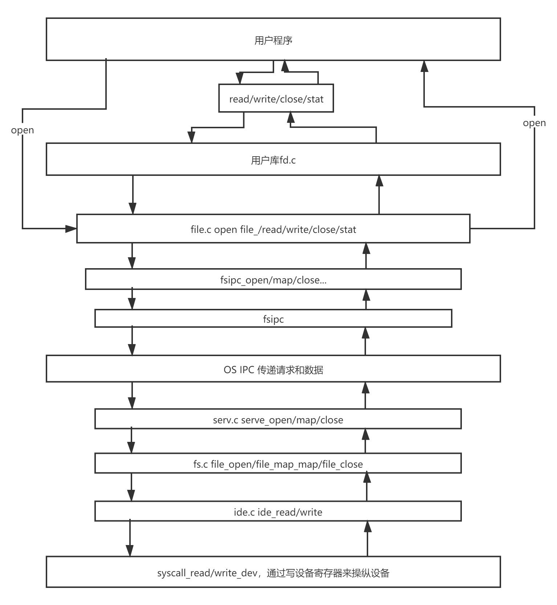

# OS Lab-5 Report

## 一、实验思考题

### Thinking 5.1

*查阅资料，了解 Linux/Unix 的 /proc 文件系统是什么？有什么作用？ Windows 操作系统又是如何实现这些功能的？proc 文件系统这样的设计有什么好 处和可以改进的地方？*

/proc 文件系统是一个虚拟文件系统，通过对这些虚拟文件的读写可以与内核中实体进行通信。具体能实现的功能包括读取系统数据、进程信息甚至修改系统参数等。Windows系统一般通过Windows API来实现类似的功能。这样的设计简化用户程序和内核空间的交互过程，更加方便快捷。

***

### Thinking 5.2

*如果我们通过 kseg0 读写设备，我们对于设备的写入会缓存到 Cache 中。通过 kseg0 访问设备是一种错误的行为，在实际编写代码的时候这么做会引发不可预知的问题。请你思考：这么做这会引起什么问题？对于不同种类的设备（如 我们提到的串口设备和 IDE 磁盘）的操作会有差异吗？可以从缓存的性质和缓存刷新的策略来考虑。*

对于写入操作：

在采用Write-back刷新策略时，写入数据只有在cache被换出时才会进行写回，导致后面的操作覆盖了前面操作，只进行最后一次操作。对串口设备，只有Cache刷新后才能看到输出，且只能看到最后一个字符。类似的，IDE磁盘可能只会写入最后一个扇区。

但如果采用Write-through策略进行刷新，CPU向Cache写入数据时，也会向内存相同地址也写一份。这样就避免了上面所说的问题，可以正常工作。

如果是读取操作：问题更大，任何一种策略都可能会读取到旧的、过时的数据，因此产生错误。

***

### Thinking 5.3

*一个磁盘块最多存储 1024 个指向其他磁盘块的指针，试计算，我们 的文件系统支持的单个文件的最大大小为多大？*

单个文件最多有1024个指针，单个文件最大大小为 1024 * 4 KB = 4096 KB = 4 MB

***

### Thinking 5.4

*查找代码中的相关定义，试回答一个磁盘块中最多能存储多少个文件 控制块？一个目录下最多能有多少个文件？*

一个磁盘块最多存储16个文件控制块；单个文件最多有1024个指针，指向1024个磁盘块，所以一个目录下最多16384个文件。

***

### Thinking 5.5

*请思考，在满足磁盘块缓存的设计的前提下，我们实验使用的内核支持的最大磁盘大小是多少？*

根据我们小操作系统的代码，我们磁盘最大的大小不能超过DISKMAX，0x40000000字节，也就是1GB。

但是，如果但从系统架构所决定的最大可支持的磁盘大小角度考虑，0x10000000之下要存储一页ipc用的buffer，所以必须从DISKMAP，0x10000000开始映射缓存的硬盘块。缓存的硬盘块是在serv.c这个用户内存空间里的，而serv.c进程会从FILEVA，0x60000000开始，为Open结构分配空间。

一个正常的用户进程中，FDTABLE，也就是(FILEBASE-PDMAP)的位置是放置fd的。但是考虑到我们serv.c本身就是文件系统服务，不会也无法使用用户态提供的fd系列操作，且我们的Open结构的空间也覆盖了fd的Data区域，所以其实我们不需要考虑这个问题。

根据上面的结论，可以得出，serv.c可以被用来缓存磁盘块的大小的空间是0x10000000-0x60000000共0x50000000，1.25GB空间

（当然如果考虑到我们的物理内存大小只有64MB的话（就算采用内存置换也因为磁盘是固定块缓存的，等于你存进去还是在内存里约等于没存）咱们这个文件系统能支持的大小就只有空闲内存容量了吧）

***

### Thinking 5.6

*如果将 DISKMAX 改成 0xC0000000, 超过用户空间，我们的文件系统还能正常工作吗？为什么？*

不能，根据上面的分析，在大于0x50000000之后，就会覆盖掉Open结构进而可能出现潜在问题，达到0xC0000000, 超过用户空间之后更是会试图访问内核数据，会引发异常并panic

***

### Thinking 5.7

*阅读 user/file.c ，你会发现很多函数中都会将一个 struct Fd * 型的 指针转换为 struct Filefd * 型的指针，请解释为什么这样的转换可行。*

user/file.c里的struct Fd *指针都是open之后的，而open的过程中调用了fsipc_open函数，并将一个struct Fd型指针的值发送给serv。serv会用ipc将fd指针的所在页映射上一个struct Filefd。而Filefd的第一个元素就是一个Fd，因此转换之后不会出现问题。

***

### Thinking 5.8

*请解释 Fd, Filefd, Open 结构体及其各个域的作用。比如各个结构体 会在哪些过程中被使用，是否对应磁盘上的物理实体还是单纯的内存数据等。说明 形式自定，要求简洁明了，可大致勾勒出文件系统数据结构与物理实体的对应关系 与设计框架。*

1. struct Fd定义在user/fd.h，是一个文件描述符结构，是库函数保存用户进程已打开文件使用的。
   - fd_dev_id：打开文件的id，也就是该文件描述符对应的抽象文件的实际类型
   - fd_offset：当前读/写的偏移值，也就是下一次操作从文件的哪个地方开始
   - fd_omode：当前文件打开的模式，只读/只写/读写等，可在判定操作是否合法时用。
2. struct Filefd定义在user/fd.h，是文件描述符+文件id+文件控制块的结构
   - f_fd：一个文件描述符。
   - f_fileid：对应于一个全局的文件编号，用来向文件系统请求服务。
   - f_file：对应文件的文件控制块。
3. struct Open定义在fs/serv.c，是文件系统服务用来保存整个系统的已打开文件的结构。
   - o_file：真实的，指向对应文件在硬盘块缓存上文件控制块的地址，用来对文件进行属性进行更改。
   - o_fileid：全局唯一的文件编号，和struct Filefd里的f_fileid对应。
   - o_mode：文件打开的模式，和struct Fd的fd_omode对应

***

## 二、实验难点图示

文件系统调用过程

注意open函数比较特殊，直接由用户调用位于file.c中的内容而不需要经过fd.c的抽象

## 三、体会与感想

Lab-5的难度明显比之前有所增加，整个函数的调用关系非常复杂，要填写的代码内容虽然不多，但是要读的代码却很多。

Lab-5代码的理解就是把握住文件系统里的层层抽象，ide.c将将磁盘块的操作抽象出来；serv.c将磁盘抽象为一个目录树，利用ipc提供文件系统服务；file.c利用fsipc.c封装对于文件的种种操作；fd.c更进一层提供了对所有“虚拟文件类型”的访问操作。

只有深入的理解代码，才能真正学好OS实验，Debug才能如鱼得水（虽说按理来说真正读懂应该就不会有啥大Bug来着）。